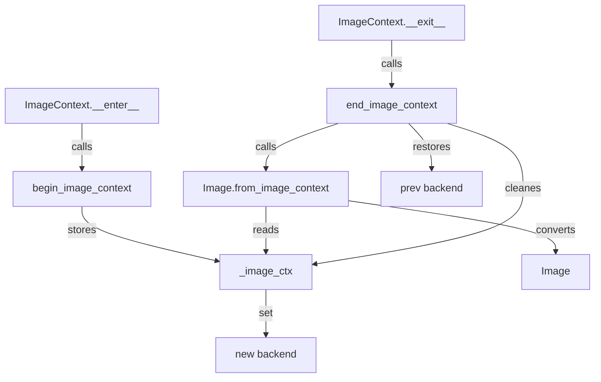

```mermaid
graph TD
    A[begin_image_context] -->|stores| B[_image_ctx]
    B -->|set| C[new backend]
    D[ImageContext.__enter__] -->|calls| A
    E[Image.from_image_context] -->|reads| B
    E -->|converts| F[Image]
    G[end_image_context] -->|calls| E
    G -->|restores| H[prev backend]
    G -->|cleanes| B
    I[ImageContext.__exit__] -->|calls| G
```